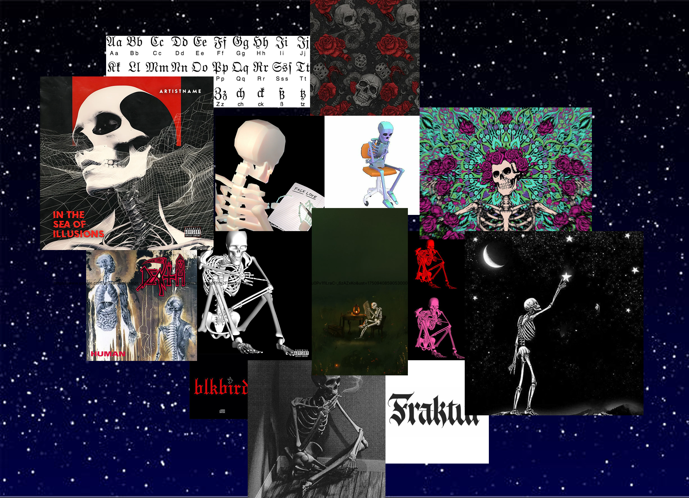

# Lund Album Cover

## Membres du groupe

- Raphaël CHICHE
- Léo RICHÉ

## Description du projet

Notre concept est l'invention d'une couverture d'album générée dynamiquement de l'artiste 'Lund' qui utilise une DA avec des squelettes. Nous avons décidé d'ajouter des fleurs et d'utiliser ce gif car 'Lund' est un artise orienté vers du rap triste. Le gif retire des pétales de la fleur pour montrer sa tristesse et les fleurs devant lui sont celles qu'il n'a pas encore prises.

## Moodboard

Voici notre moodboard avec nos inspirations, notamment et principalement par l'artiste Lund et les squelettes (qu'il utilise sur ses covers).

## Instructions pour lancer le projet

1. **Téléchargez** ou **clonez** ce dépôt sur votre ordinateur.
2. Ouvrez le dossier du projet dans votre éditeur (par exemple Visual Studio Code).
3. Ouvrez le fichier `index.html` dans votre navigateur web (double-cliquez ou faites clic droit > "Ouvrir avec...").
4. Assurez-vous que les fichiers `coverRecto.js` et `style.css` sont bien dans le même dossier que `index.html`.

Aucune installation supplémentaire n'est nécessaire, tout fonctionne en local avec un navigateur moderne.